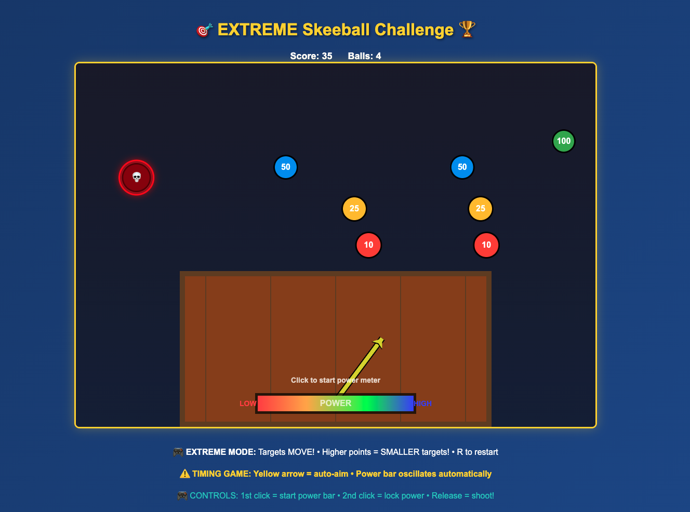

# 🎯 EXTREME Skeeball Challenge 🏆

An intense, feature-packed skeeball game with moving targets, oscillating controls, and dangerous obstacles!



## 🔥 Game Features

### 🎯 **Extreme Challenge Mode**
- **Moving Targets**: All scoring holes oscillate completely across the screen
- **Auto-Oscillating Aim**: Yellow arrow moves automatically - perfect timing required
- **Auto-Oscillating Power**: Power bar moves automatically - click to lock power level
- **Danger Zone**: Skull hole that steals extra balls - avoid at all costs!

### 🌈 **Beautiful Graphics**
- **Eye-friendly colors**: Green (100pts), Blue (50pts), Yellow (25pts), Red (10pts)
- **Thick 2D arrows** with black outlines for clear visibility
- **Smooth animations** and particle effects
- **Professional UI** with gradient backgrounds

### 🏆 **Leaderboard System**
- **Top-right leaderboard** showing current high score
- **Click to view top 10** with names and dates
- **Persistent storage** - scores saved permanently
- **Medal system** with gold, silver, bronze rankings

### ⚡ **Advanced Controls**
- **3-step shooting**: Click to start power → Click to lock power → Release to shoot
- **Reverse physics**: Smaller ball (8px) for increased difficulty
- **Similar target sizes** with only 5% difference for fair challenge
- **Full-screen oscillation** - no safe zones!

## 🎮 How to Play

1. **Watch the yellow arrow** - it shows your current aim direction
2. **Click once** to start the power bar oscillation
3. **Click again** to lock in your desired power level
4. **Time your release** when the aim arrow points where you want to shoot
5. **Avoid the skull hole** (💀) - it steals an extra ball!
6. **Hit moving targets** for points: Green=100, Blue=50, Yellow=25, Red=10

## 🚀 Installation & Running

### Web Version (Recommended)
```bash
# Simply open the HTML file
open index.html
```

### Python Version
```bash
# Install dependencies
pip install -r requirements.txt

# Run the game
python3 arcade_skeeball.py
```

## 🎯 Challenge Levels

- **Beginner**: Score 100+ points
- **Intermediate**: Score 300+ points  
- **Advanced**: Score 500+ points
- **Expert**: Score 800+ points
- **Master**: Score 1000+ points

## 🔥 Game Mechanics

### 🎯 **Scoring System**
- **🟢 Green Holes**: 100 points (fastest moving, smallest)
- **🔵 Blue Holes**: 50 points (fast moving)
- **🟡 Yellow Holes**: 25 points (medium speed)
- **🔴 Red Holes**: 10 points (slower moving, largest)
- **💀 Skull Hole**: DANGER - Lose extra ball!

### ⚡ **Difficulty Features**
- All targets move completely left-to-right across screen
- Auto-oscillating aim requires perfect timing
- Auto-oscillating power adds second timing challenge
- Danger hole creates high-risk gameplay
- Similar target sizes make precision crucial

## 🏆 High Score Features

- **Persistent leaderboard** with top 10 scores
- **Player names and dates** for each score
- **Medal rankings** (🥇🥈🥉) for top 3 players
- **Click-to-view** popup with full leaderboard
- **Auto-display** after achieving new high score

## 🎨 Visual Design

- **Material Design colors** - scientifically chosen for eye comfort
- **Thick 2D arrows** with black outlines for visibility
- **Smooth gradients** and professional styling
- **Particle effects** and glow animations
- **Responsive design** that works on all screen sizes

## 🔧 Technical Features

- **HTML5 Canvas** for smooth 60fps gameplay
- **LocalStorage** for persistent high score database
- **Responsive controls** with visual feedback
- **Optimized physics** for realistic ball movement
- **Cross-browser compatibility**

## 📱 Controls

- **Mouse**: Navigate and interact
- **Click**: Start power meter / Lock power
- **Release**: Shoot ball
- **R Key**: Restart game
- **Click Leaderboard**: View top 10 scores

---

**Ready for the ultimate skeeball challenge?** 🎯🔥

*Can you master the timing, avoid the dangers, and claim the top spot on the leaderboard?*